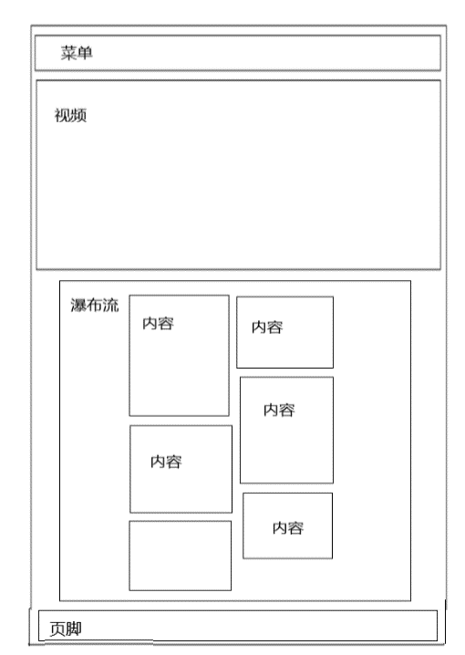
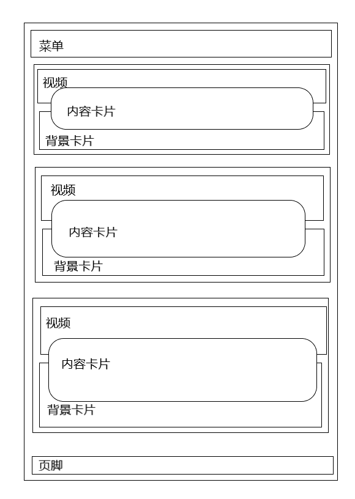
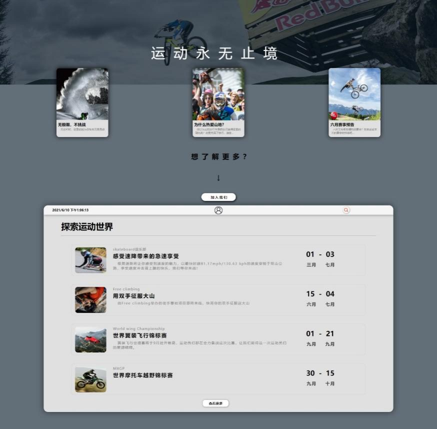

# 网页规划说明书

网页名称： 永远热爱（极限运动宣传网站）

专业名称： 软件技术

班级名称： 软件技术2班

成员： 王杰24（负责人），李西东11，梁友欢19，林泽铨17

完成时间： 2021.6.10

## 一、网页规划设计说明

### 1、总体设计

作为一个年轻的、吸引年轻同好的极限运动宣传网站，我们在菜单栏提供了5个栏目，简易的展现网站能够提供的信息。

在网页中我们加入了大量的交互动画，使网页宛如有生命一般。

网站采用上中下结构，上边是菜单，中间是内容，下边是页眉

网页的主色调我们采用了浅灰色或亮白色。

### 2、内容规划

### （1）首页

负责人：王杰

简介：

首页在头部使用一个自动播放且静音的视频吸引用户的眼球，然后在下边使用瀑布流，让用户继续浏览，在瀑布流中使用鼠标悬浮动画，使网页更加灵动，也能展现更多内容。

{width="2.323611111111111in" height="3.26875in"}
HTML结构图：

页面测试结果：

{width="4.1875in" height="6.774305555555555in"}
（Edge版本 91.0.864.41下测试）

### （2）运动介绍页

负责人：王杰24

简介：

在运动介绍页中，我们将内容分为了三个模块，分别概述三种极限运动的介绍和来源，一个模块分为视频部分和一个悬浮的小卡片，为了使视频上和卡片上的文本能够更加清晰，我们还在两个部分上面加了一个灰蓝色的滤镜"滤镜"，当用户将光标移动到某个模块的时候，整个模块的内容就会以动画的方式呈现出来，灵动，生趣。整个颜色主色调使用灰蓝色，我们希望用户在了解极限运动的时候能够沉浸进去，去感受到极限运动的魅力。

{width="3.379861111111111in"
height="4.754166666666666in"} HTML结构图：

页面测试结果：

{width="3.8027777777777776in"
height="6.008333333333334in"}（Edge版本 91.0.864.41下测试）

### （3）运动员页

负责人：林泽铨17

简介：

-   在有限的页面传输生动信息

-   运用动画的效果使页面更加富有活力

-   少就是多，简介就是丰富

-   让你感受到红牛的热血

HTML结构图：

{width="5.768055555555556in"
height="4.779861111111111in"}

页面测试结果：

{width="5.768055555555556in"
height="7.263194444444444in"}

谷爱凌个人页

负责人：林泽铨17

HTML：

{width="5.768055555555556in"
height="5.653472222222222in"}

页面测试结果：

{width="5.768055555555556in"
height="7.263194444444444in"}

### （4）活动介绍页

负责人：梁友欢19

简介：

此页面采用大量的动画和过渡，使网页更加灵动，年轻

HTML：

{width="5.760416666666667in"
height="3.2395833333333335in"}

页面测试结果：

{width="3.9715277777777778in"
height="3.8986111111111112in"}

登陆页面：

负责人：梁友欢19

{width="5.760416666666667in"
height="3.2395833333333335in"}HTML：

页面测试结果：

{width="5.767361111111111in"
height="2.9368055555555554in"}

### （5）商品介绍页

负责人：李西东 11

简介：

首先我在我们组负责的是商品这一块，我选取了与极限运动有着密切练习的产品-红牛。

1.设计理念：

 让客户了解这款产品

 向客户传达这款设计的初衷

 我想向顾客传达的产品理念

 运用一些简单的css动画向顾客进行传输

{width="2.736111111111111in"
height="2.357638888888889in"}HTML：

页面测试结果：

{width="1.9625in" height="3.5145833333333334in"}

### （6）商品具体页

负责人：李西东11

HTML：

{width="2.736111111111111in"
height="2.2888888888888888in"}

页面测试结果：

{width="2.3875in" height="6.126388888888889in"}

心得：此次学习让我们了解了相关技术，也对前端有了充分的认识
